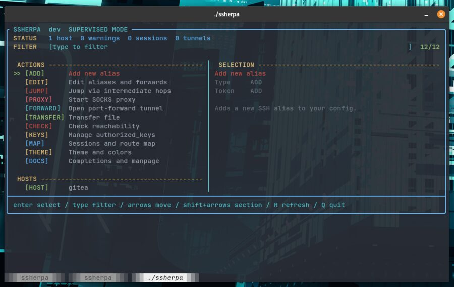

# ssherpa

A terminal UI for the SSH config you already have — and a supervisor that keeps
you from getting lost in it. `ssherpa` reads `~/.ssh/config`, lets you fuzzy-pick
a host and connect, then runs that connection under supervision so you can always
see where you are in a stack of hops and bail out of the whole thing at once.

<!-- A recorded demo (docs/demo.gif, made with charmbracelet/vhs) could replace this still. -->



OpenSSH stays the source of truth. ssherpa never invents its own config format or
connection layer — it reads and edits your real config and shells out to your
real `ssh`, and every write is previewable and reversible. What it adds is the
layer OpenSSH doesn't: visibility into, and control over, nested sessions.

## Features

- **Supervised sessions** — every connection runs under a PTY supervisor that
  adds a live [session-map overlay](#supervised-sessions), a one-keystroke
  [escape rope](docs/escape-rope.md) out of every nested hop, a queued-input
  composer, an optional latency watchdog, and recorded session lineage.
- **Fuzzy host picker** over your parsed `~/.ssh/config`, including `Include`
  files, with source line numbers and duplicate-host warnings.
- **Safe config edits** — `add`, `edit set`, `edit delete`. Every mutation shows
  a dry-run diff, backs up the existing file, and writes atomically with
  permissions preserved.
- **`authorized_keys` management** — list, add, merge, replace, and delete keys
  by fingerprint, preserving key options and cert types.
- **Jump, proxy, and forward** — build a `ProxyJump` route through one or
  more hops, start a local SOCKS proxy through any alias, or open a local
  TCP port-forward (`-L`) tunnel for things like a remote Postgres.
- **Connection checks** — test aliases and saved forward presets with
  `BatchMode` SSH probes, SSH RTT timing, and best-effort ICMP latency.
- **`--print` mode** — print the exact `ssh` command instead of running it, so
  you can see, copy, or script what ssherpa would do.
- **Themeable** — inherits your terminal palette by default; tune every UI role
  in a live editor (`ssherpa theme`). Honors `NO_COLOR`.

## Supervised sessions

This is the part ssherpa was built to fix. You `ssh` to a bastion, then to a host
behind it, then to another, and three hops deep you've lost track of where you
are — and getting out means `exit`, `exit`, `exit`, hoping you counted right.

By default every connection runs under a PTY supervisor. `ssh` behaves exactly as
it normally would, but ssherpa stays in the loop and gives you a control layer on
top of it, reachable without disturbing the remote shell.

### Session-map overlay — `Ctrl-]`

Press `Ctrl-]` at any time to overlay a live map of your active sessions and the
route that got you to each one. Press `Ctrl-]`, `q`, or `Esc` to dismiss it and
you're back exactly where you were.

### Escape rope — disconnect every layer at once

`Ctrl-]` then `X` (and `X` again to confirm) pulls the **escape rope**: it tears
down every nested session in the stack and drops you back at your outermost shell
in a single move — no counting `exit`s. When a layer is wedged, mash `Ctrl-]`
three times for a no-confirm panic exit. It works no matter how many
`ssherpa → ssh → ssherpa` layers deep you are;
[`docs/escape-rope.md`](docs/escape-rope.md) explains how the teardown cascades.

### Queued-input composer — `Ctrl-G`

Compose a line locally and send it on your terms: Enter sends it with a newline,
`Ctrl-G` sends it raw, `Ctrl-U` clears, `Esc` cancels. Useful for staging a
command before committing it to a fragile or high-latency link.

| Key | Action |
| --- | --- |
| `Ctrl-]` | Open the session-map overlay (again / `q` / `Esc` to return) |
| `Ctrl-]` then `X`, `X` | Escape rope — disconnect every layer, back to the outermost shell |
| `Ctrl-]` ×3 (fast) | Panic escape rope, no confirm |
| `Ctrl-G` | Queued-input composer |

### Latency watchdog (opt-in)

Have ssherpa probe the link with a sidecar `ssh` and warn you when it turns
unhealthy — or, only if you ask for it, disconnect after a sustained outage:

```sh
ssherpa --select prod --latency-warn 2s
ssherpa --select prod --latency-warn 2s --latency-disconnect 30s
```

### Session records and maps

Every supervised session is recorded as `0600` JSON (under
`~/.local/state/ssherpa` on Linux, `~/Library/Application Support/ssherpa` on
macOS), including its parent and route, so you can reconstruct the lineage after
the fact:

```sh
ssherpa session map            # active sessions as a tree, with their routes
ssherpa session map --all      # include exited sessions
ssherpa session list           # flat list
ssherpa session show <id>      # one record in detail
ssherpa session prune --older-than 168h --dry-run
```

Prefer the old behavior? `--direct` runs `ssh` straight through with no overlay,
watchdog, or state.

## Installation

### Homebrew

```sh
brew tap 0xbenc/tap
brew install ssherpa
```

Or install directly:

```sh
brew install 0xbenc/tap/ssherpa
```

### Prebuilt binaries

Grab a build for your platform from the
[latest release](https://github.com/0xbenc/ssherpa/releases/latest) —
`tar.gz` archives for Linux and macOS (amd64 and arm64), plus `.deb` and
`.rpm` packages for Linux. For the archives:

```sh
tar -xzf ssherpa_*_linux_amd64.tar.gz
sudo install ssherpa /usr/local/bin/
```

On Debian/Ubuntu or Fedora/RHEL, install the package instead:

```sh
sudo dpkg -i ssherpa_*_linux_amd64.deb     # or: sudo rpm -i ssherpa_*_linux_amd64.rpm
```

### With Go

Requires Go 1.26 or newer.

```sh
go install github.com/0xbenc/ssherpa/cmd/ssherpa@latest
```

### From source

```sh
git clone https://github.com/0xbenc/ssherpa
cd ssherpa
go build -o ssherpa ./cmd/ssherpa
```

## Usage

Run `ssherpa` with no arguments to open the picker, filter to a host, and press
Enter to connect:

```sh
ssherpa
```

Skip the picker with `--select`, and use `--print` to see the command without
running it:

```sh
ssherpa --select prod                       # connect to alias "prod"
ssherpa --print --select prod               # print: ssh prod
ssherpa --print --select prod -- -L 8080:localhost:8080   # pass-through ssh args after --
```

### List and inspect hosts

```sh
ssherpa list                                # list of aliases
ssherpa list --json --filter prod --user alice
ssherpa show prod --json                    # one alias, parsed effective values
```

### Edit your config safely

Every mutation defaults to asking for confirmation; add `--dry-run` to preview
the diff, or `--yes` to skip the prompt.

```sh
ssherpa add --alias prod --host prod.example.com --user alice --dry-run
ssherpa add --alias prod --host prod.example.com --user alice --yes
ssherpa edit                                  # TUI for aliases and saved forwards
ssherpa edit set prod --port 2222 --identity ~/.ssh/prod --yes
ssherpa edit delete prod --dry-run
ssherpa edit delete-all --filter scratch --dry-run
```

### Jump hosts, SOCKS proxy, and port-forward tunnels

```sh
ssherpa jump --dest prod --hop bastion --hop edge --print   # ssh -J bastion,edge prod
ssherpa proxy --select prod --bind 127.0.0.1 --port 1080 --print
ssherpa forward --select pgbox --local 5432 --remote 127.0.0.1:5432 --print
ssherpa forward --select pgbox --local 5433 --remote db.internal:5432 --through bastion
```

`forward` opens a local TCP port-forward (the `ssh -L` flag) and runs it
under the same supervised PTY as the other commands — so the tunnel
shows up in `ssherpa session map` with a `[tunnel]` badge and the
escape rope tears it down alongside any interactive sessions.

Save reusable forward presets in ssherpa's state catalog:

```sh
ssherpa forward saved save pg --select pgbox --local 5432 --remote 127.0.0.1:5432
ssherpa forward saved list
ssherpa forward saved show pg --json
ssherpa forward saved edit pg --description "local postgres"
ssherpa forward saved rename pg prod-pg
ssherpa forward saved delete prod-pg --yes
ssherpa forward --select pg --background
```

### Check SSH reachability

`check` runs a non-interactive SSH probe and reports elapsed SSH time in
milliseconds. It also attempts an ICMP ping when possible; ICMP failures are
reported separately because many networks block ping while SSH still works.

```sh
ssherpa check prod
ssherpa check --filter prod --json
ssherpa check --saved-forward pg --no-icmp
ssherpa check --saved-forwards --timeout 3s
```

Shell completions are shipped in `completions/`, and the manpage is shipped as
`man/ssherpa.1`.

### Manage authorized_keys

Operates on `~/.ssh/authorized_keys` by default. Point it elsewhere with `--path`
or `SSHERPA_AUTHORIZED_KEYS_PATH` (handy for testing).

```sh
ssherpa authkeys list --json
ssherpa authkeys add --key-file ~/.ssh/id_ed25519.pub --dry-run
ssherpa authkeys merge --from-dir ./keys --dry-run
ssherpa authkeys delete --fingerprint SHA256:... --yes
```

## Configuration

Flags override environment variables, which override the defaults.

| Flag | Env | Default |
| --- | --- | --- |
| `--config PATH` | — | `~/.ssh/config` |
| `--ssh-binary PATH` | `SSHERPA_SSH_BINARY` | `ssh` (or `kitten ssh` under Kitty) |
| `--state-dir PATH` | `SSHERPA_STATE_DIR` | platform state dir |
| `--path PATH` (authkeys) | `SSHERPA_AUTHORIZED_KEYS_PATH` | `~/.ssh/authorized_keys` |
| `--theme-file PATH` | `SSHERPA_THEME_FILE` | `~/.config/ssherpa/theme.conf` |
| `--no-color` | `SSHERPA_NO_COLOR`, `NO_COLOR` | color on |
| `--no-kitty` | `SSHERPA_NO_KITTY` | Kitty detection on |

See `ssherpa help` for the full flag list.

## Themes

The UI inherits your terminal's palette by default, so it matches whatever color
scheme your emulator uses. Run `ssherpa theme` (or pick **Theme and colors** in
the picker) for a live editor where each row previews its own color, a palette
panel shows the exact token to type for every color, and `t` toggles a
high-contrast mode so the text stays readable on any background.

The color config lives in `~/.config/ssherpa/theme.conf`:

```text
primary = cyan
accent  = yellow
success = green
danger  = red
pill    = bold reverse
```

Values are color names (`cyan`, `bright-blue`), style tokens (`bold`, `reverse`),
or raw SGR codes (`38;2;96;221;255`).

## What it does and doesn't do

- It **does** read and edit your real OpenSSH config and `authorized_keys`, and
  run your real `ssh`. Edits are parser-backed, previewable (`--dry-run`),
  confirmed by default, backed up, and written atomically.
- It **does not** store connections, credentials, or hosts in a separate
  database, replace `ssh`, or modify anything without showing you first.
- Destructive operations on multi-alias or wildcard `Host` stanzas are guarded,
  and bulk deletes require an explicit confirmation phrase.

## Development

Local checks expected before committing are in
[`CONTRIBUTING.md`](CONTRIBUTING.md); the Go toolchain setup is in
[`docs/development.md`](docs/development.md).

```sh
go test ./...
go vet ./...
gofmt -l ./cmd ./internal
```

## License

[MIT](LICENSE) © Ben Chapman

<sub>My desktop wallpaper is visible behind the terminal | by [Robh](https://broadviewgraphics.blogspot.com/2012/11/tron-uprising-update.html).</sub>
